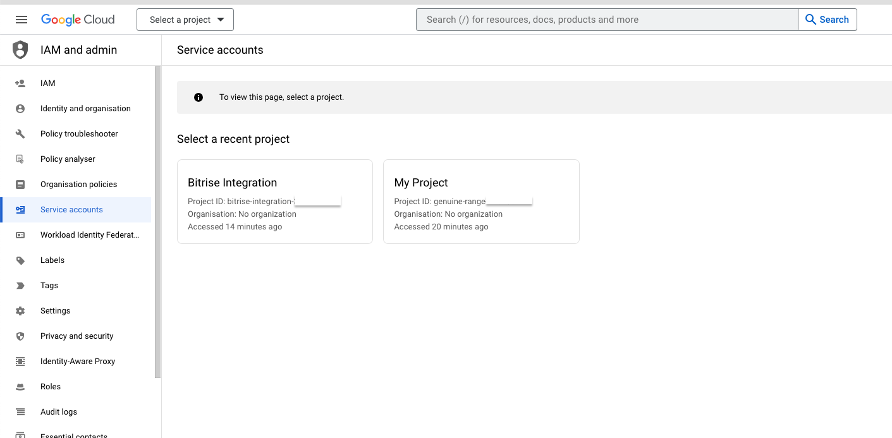

# Effortless App Distribution: Publish Your Android App on Google Play Using Bitrise

## Introduction
Welcome to **Part 2** of our comprehensive guide on publishing your Android app using **Bitrise**! In Part 1 of this series (if you haven't read it yet, you can find it [here](https://blog.numericaideas.com/accelerate-android-app-delivery-via-bitrise-ci-cd-pipelines)), we walked you through the process of generating a signed app binary using **Bitrise**, empowering you to automate and streamline your app's build process. Now, in this eagerly awaited continuation, we will dive into the next crucial step: setting up Google Play and getting your app ready for publication. So, fasten your seatbelts as we explore the ins and outs of leveraging **Bitrise** to seamlessly upload and publish your **Android** app on the world's largest app distribution platform. Let's get started!

## Setting up Google Cloud Platform
You need a **Service Account** created in the **Google Cloud Platform** so that Bitrise can authenticate with Google Play Deploy to publish your app. The new **Service Account** has to be invited to **Google Play Console** as a user with the appropriate permission. Before we get started, sign up on **Google Cloud Platform** [here](https://cloud.google.com).
### Create a Service Account
Applications use Service Accounts to make authorized API calls by authenticating as either the service account itself, or as Google Workspace or Cloud Identity users through domain-wide delegation. When an application authenticates as a service account, it has access to all resources that the service account has permission to access. Here is how you can create a service account.

*Skip to step 4 if you want to use an existing project.*
1. Go to Google Cloud [console](https://console.cloud.google.com/).
2. Click on current project name in the top-left part of the page to switch to the desired project.

3. Click on **New Project** to create a new project and enter a name for the new project.

4. Go to the [Create Service Account](https://console.cloud.google.com/projectselector/iam-admin/serviceaccounts) page and select a project from the list

5. Enter the service account  **Name** and **Description** and click **Create and Continue**.

6. Select **Browser** as the role for the Service Account.

7. Keep the 3rd step as it is and click **Done** to finish creating the service account.

### Create Private Key for Service Account 
After creating the Service Account, you will be redirected to the [list](https://console.cloud.google.com/iam-admin/serviceaccounts) of all Service Accounts.

1. Click on the 3-dotted icon on the right side of your Service Account and select **Manage Keys**.

2. On the keys page, click **ADD KEY** -> **Create new Key**. Keep **JSON** as the selected type and click **Create**. This will automatically download and save the key to your local machine. 
Keep this file safe as it will be needed later when configuring **Bitrise** settings.
## Setting up Google Play Console